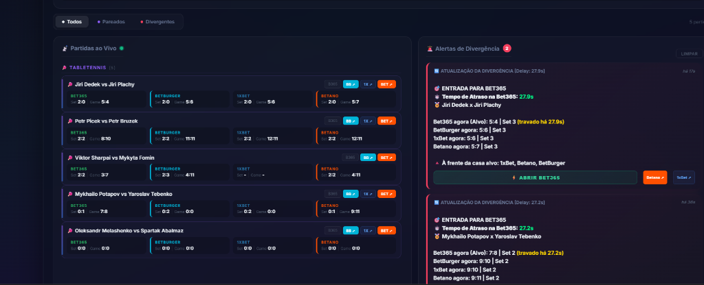
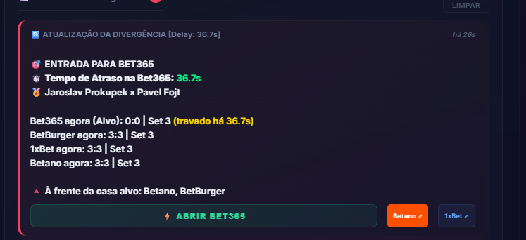
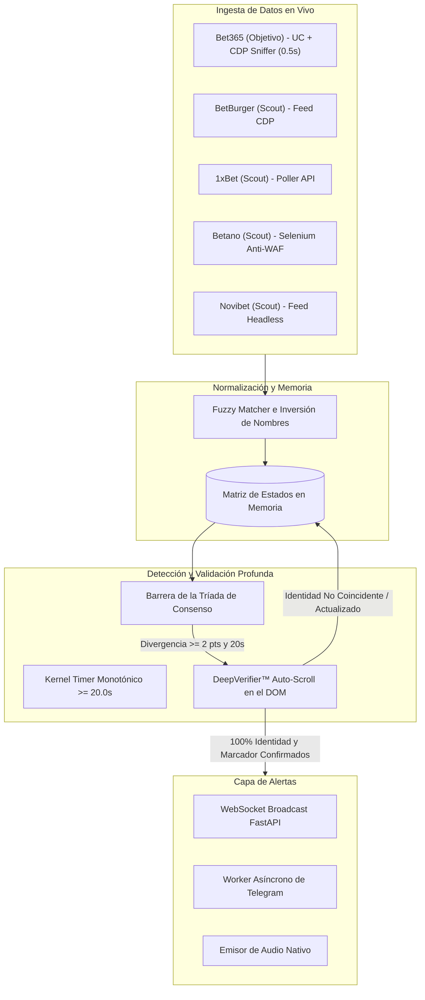

<div align="center">

# ⚡ Monitor de Divergencia de Cuotas y Marcador en Vivo
### *Motor de Arbitraje Deportivo y Detección de Retardo en Casas de Apuestas*

[](https://www.python.org/)
[](https://fastapi.tiangolo.com/)
[](https://playwright.dev/)
[](https://telegram.org/)
[](LICENSE)
[](https://github.com/FabioArieiraBaia/odds_monitor/stargazers)

<p align="center">
  <a href="README.md"><b>English</b></a> •
  <a href="README.pt-BR.md"><b>Português (Brasil)</b></a> •
  <a href="README.es.md"><b>Español</b></a>
</p>

</div>

---

## 📌 Descripción General

**Odds Monitor** es un motor de arbitraje deportivo de alta frecuencia diseñado para detectar **retrasos, marcadores congelados y cuotas desactualizadas** en casas de apuestas objetivo (**Bet365**) en comparación con feeds de referencia en tiempo real (**BetBurger, 1xBet, Betano, Novibet**).

Construido con **Python 3.11, FastAPI, Playwright CDP Sniffing** y una máquina de estados ultra reactiva, el sistema aísla congelamientos reales con **cero falsos positivos**, alertas sonoras y notificaciones instantáneas en Telegram con enlaces directos al evento en vivo.

---

## 🖼️ Demostración del Panel en Vivo

<div align="center">
  
  <p><i>Monitoreo Multi-Casas de Tenis de Mesa con Emparejamiento en Tiempo Real y Tarjetas de Alerta</i></p>
</div>

<div align="center">
  
  <p><i>Alerta de Retardo con Contador Progresivo y Enlaces Directos a la Casa de Apuestas</i></p>
</div>

---

## 🚀 Características Principales

* **⚡ Ciclo de Extracción cada 0.5s:** Raspado ultrarrápido cada 500ms con flags anti-estrangulamiento de Chrome (`--disable-background-timer-throttling`, bypass de oclusión de Windows y emulación de foco vía CDP).
* **🧠 Tríada de Consenso:** Requiere que BetBurger + al menos una casa de primer nivel (1xBet, Betano o Novibet) coincidan en los puntos antes de calificar una divergencia.
* **🛡️ DeepVerifier™ con Auto-Desplazamiento:** Elimina falsos positivos causados por el desplazamiento virtual de Bet365, desplazándose automáticamente hasta el partido, validando la identidad de los atletas (>= 50%) e inspeccionando el marcador real en el DOM.
* **🛑 Escudo de Transición de Set y Fin de Partido:** Detecta matemáticamente límites de sets (`0:0` vs `1:10`) y finalización de partidos (al mejor de 3 / mejor de 5), evitando falsas alarmas.
* **📲 Notificaciones en Telegram:** Mensajes instantáneos formateados con botón de acceso directo al partido en vivo.
* **🔊 Audio Nativo:** Alertas de sonido local sin latencia para una reacción inmediata del operador.
* **💻 Panel Cyberpunk Reactivo:** Interfaz moderna con Tailwind CSS y WebSocket, mostrando partidos en vivo, tiempos de retraso y filtros dinámicos.

---

## 🏗️ Arquitectura del Sistema



---

## 🛠️ Guía de Instalación

### 1. Requisitos Previos
* **Python 3.10+** (Recomendado Python 3.11)
* **Google Chrome** (Última versión estable)
* **Git**

### 2. Clonar el Repositorio
```bash
git clone https://github.com/FabioArieiraBaia/odds_monitor.git
cd odds_monitor
```

### 3. Crear Entorno Virtual e Instalar Dependencias
```bash
python -m venv venv
# En Windows:
.\venv\Scripts\activate
# En Linux/macOS:
source venv/bin/activate

pip install -r requirements.txt
playwright install chromium
```

### 4. Configurar Variables de Entorno (`.env`)
Crea un archivo `.env` en la raíz del proyecto:
```env
# Servidor
HOST=127.0.0.1
PORT=8005

# Casas Activas
ENABLE_BET365=True
ENABLE_BETBURGER=True
ENABLE_BETANO=True
ENABLE_ONEXBET=True
ENABLE_NOVIBET=False

# Umbrales de Detección
FREEZE_THRESHOLD_SECONDS=20.0
MIN_GAME_DIFFERENCE=2

# Configuración de Telegram
TELEGRAM_BOT_TOKEN=tu_token_de_bot_aqui
TELEGRAM_CHAT_ID=tu_chat_id_aqui
```

### 5. Iniciar la Aplicación
```bash
python app/main.py
```
Abre tu navegador en **`http://localhost:8005`** para ver el panel en tiempo real.

---

## 🧪 Pruebas Automatizadas

Ejecutar la suite completa de pruebas unitarias:
```bash
python -m pytest app/test_pipeline.py -v
```

---

## 🔍 Palabras Clave & SEO

`apuestas-deportivas` `arbitraje-deportivo` `monitor-de-cuotas` `retraso-bet365` `betburger-scraper` `arbitraje-tenis-de-mesa` `bot-de-apuestas` `surebets` `valuebets` `trading-deportivo` `fastapi` `playwright-python` `chrome-devtools-protocol`

---

## 📄 Licencia

Este proyecto está bajo la Licencia MIT — consulta el archivo [LICENSE](LICENSE) para más detalles.
