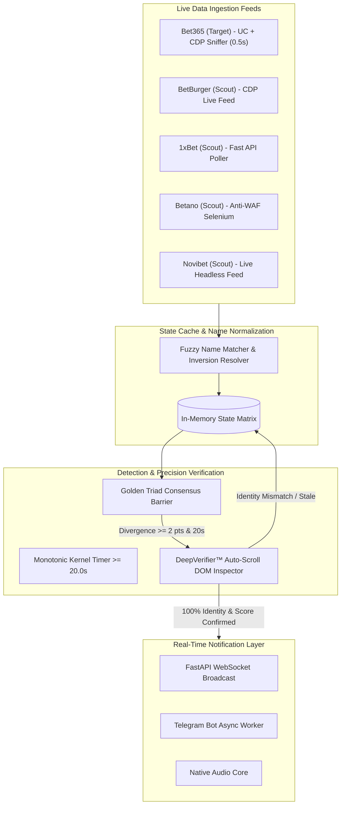

<div align="center">

# ⚡ Odds Divergence & Live Score Freeze Monitor
### *Ultra-Low Latency Arbitrage & Bookmaker Delay Detection Engine*

[](https://www.python.org/)
[](https://fastapi.tiangolo.com/)
[](https://playwright.dev/)
[](https://telegram.org/)
[](LICENSE)
[](https://github.com/FabioArieiraBaia/odds_monitor/stargazers)

<p align="center">
  <a href="README.md"><b>English</b></a> •
  <a href="README.pt-BR.md"><b>Português (Brasil)</b></a> •
  <a href="README.es.md"><b>Español</b></a>
</p>

</div>

---

## 📌 Overview

**Odds Monitor** is a state-of-the-art, high-frequency live sports arbitrage engine designed to detect **delays, stuck scoreboards, and frozen live odds** on target bookmakers (such as **Bet365**) compared against real-time consensus from reference feeds (**BetBurger, 1xBet, Betano, Novibet**).

Built with **Python 3.11, FastAPI, Playwright CDP Sniffing**, and an ultra-reactive state machine, this system isolates real bookmaker freezes with **zero false positives**, instant sound cues, and millisecond-level Telegram alerts.

---

## 🖼️ Live Dashboard Preview

<div align="center">
  
  <p><i>Live Multi-House Table Tennis Monitoring with Real-Time Score Sync & Divergence Cards</i></p>
</div>

<div align="center">
  
  <p><i>High-Precision Freeze Alert with Progressive Delay Timer & Direct Bookmaker Links</i></p>
</div>

---

## 🚀 Key Features

* **⚡ Sub-500ms Scraping Loop:** Dedicated scraping engine operating at 500ms with Chrome Anti-Throttling flags (`--disable-background-timer-throttling`, native Windows occlusion bypass, and CDP focus emulation).
* **🧠 Multi-Source Consensus (The Golden Triad):** Requires BetBurger + at least one independent tier-1 sportsbook (1xBet, Betano, Novibet) to agree on points before qualifying a divergence.
* **🛡️ DeepVerifier™ Auto-Scroll Validation:** Eliminates virtual-scrolling hallucinations by actively scrolling the bookmaker's DOM, matching player identity tokens (>= 50%), and verifying the physical scoreboard before firing alerts.
* **🛑 Set-Break & Game Completion Shield:** Mathematically detects set boundaries (e.g. `0:0` vs `1:10`) and match completion states, preventing set-transition false alarms.
* **📲 Instant Telegram Dispatcher:** Async rate-limited push notifications to Telegram with one-click deep links directly to the in-play match.
* **🔊 Native Hardware Audio:** Zero-delay local sound triggers for immediate operator reaction.
* **💻 Cyberpunk Live Dashboard:** Reactive WebSocket UI built with Tailwind CSS, showing live paired matches, delay timers, and dynamic filters.

---

## 🏗️ System Architecture



---

## 🛠️ Quick Start

### 1. Prerequisites
* **Python 3.10+** (Python 3.11 recommended)
* **Google Chrome** (Latest stable version)
* **Git**

### 2. Clone the Repository
```bash
git clone https://github.com/FabioArieiraBaia/odds_monitor.git
cd odds_monitor
```

### 3. Setup Virtual Environment & Dependencies
```bash
python -m venv venv
# On Windows:
.\venv\Scripts\activate
# On Linux/macOS:
source venv/bin/activate

pip install -r requirements.txt
playwright install chromium
```

### 4. Configuration (`.env`)
Create a `.env` file in the root directory:
```env
# Server
HOST=127.0.0.1
PORT=8005

# Scrapers
ENABLE_BET365=True
ENABLE_BETBURGER=True
ENABLE_BETANO=True
ENABLE_ONEXBET=True
ENABLE_NOVIBET=False

# Detection Thresholds
FREEZE_THRESHOLD_SECONDS=20.0
MIN_GAME_DIFFERENCE=2

# Telegram Alert Settings
TELEGRAM_BOT_TOKEN=your_bot_token_here
TELEGRAM_CHAT_ID=your_chat_id_here
```

### 5. Launch the Application
```bash
python app/main.py
```
Open your browser at **`http://localhost:8005`** to access the live dashboard!

---

## 🧪 Automated Testing

Run the full unit test suite:
```bash
python -m pytest app/test_pipeline.py -v
```

---

## 🔍 SEO & Keywords

`sports-betting` `arbitrage-betting` `odds-monitor` `bet365-delay` `betburger-scraper` `table-tennis-arbitrage` `live-betting-bot` `surebets` `valuebets` `in-play-trading` `fastapi` `playwright-python` `chrome-devtools-protocol` `sports-arbitrage` `sportsbook-scraper`

---

## 📄 License

This project is licensed under the MIT License — see the [LICENSE](LICENSE) file for details.
