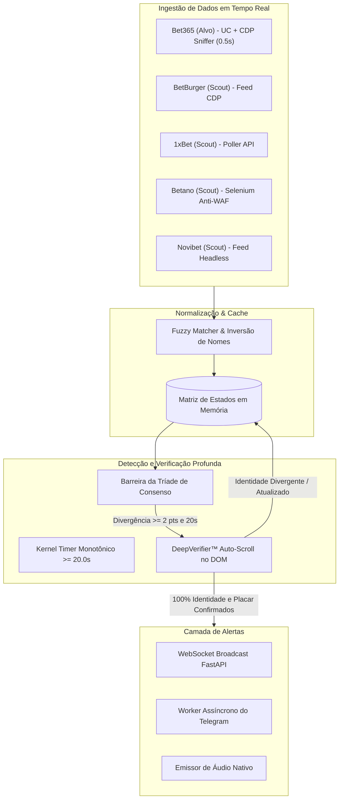

<div align="center">

# ⚡ Monitor de Divergência de Odds e Travamento de Placar Ao Vivo
### *Motor de Arbitragem Esportiva e Detecção de Atraso de Casas de Apostas em Tempo Real*

[](https://www.python.org/)
[](https://fastapi.tiangolo.com/)
[](https://playwright.dev/)
[](https://telegram.org/)
[](LICENSE)
[](https://github.com/FabioArieiraBaia/odds_monitor/stargazers)

<p align="center">
  <a href="README.md"><b>English</b></a> •
  <a href="README.pt-BR.md"><b>Português (Brasil)</b></a> •
  <a href="README.es.md"><b>Español</b></a>
</p>

</div>

---

## 📌 Visão Geral

O **Odds Monitor** é um sistema profissional de alta frequência projetado para identificar **atrasos, placares travados e odds desatualizadas** na casa alvo (**Bet365**) em comparação direta com o consenso em tempo real de feeds de referência (**BetBurger, 1xBet, Betano, Novibet**).

Desenvolvido em **Python 3.11, FastAPI, Playwright CDP Sniffing** e uma máquina de estados ultra-reativa, o sistema isola travamentos reais com **zero falsos positivos**, alertas sonoros instantâneos e notificações via Telegram em milissegundos com link direto para a aposta.

---

## 🖼️ Demonstração do Painel Ao Vivo

<div align="center">
  
  <p><i>Monitoramento Multi-Casas de Tênis de Mesa com Pareamento em Tempo Real e Cards de Divergência</i></p>
</div>

<div align="center">
  
  <p><i>Alerta de Travamento com Cronômetro de Atraso Progressivo e Botões de Acesso Rápido</i></p>
</div>

---

## 🚀 Principais Recursos

* **⚡ Loop de Extração a cada 0.5s:** Raspagem ultrarrápida a cada 500ms com flags anti-estrangulamento do Chrome (`--disable-background-timer-throttling`, bypass de oclusão do Windows e emulação de foco ativo via CDP).
* **🧠 Regra de Ouro da Tríade de Consenso:** Exige que o BetBurger + no mínimo 1 casa de apostas de ponta (1xBet, Betano ou Novibet) confirmem o placar adiantado antes de disparar o alerta.
* **🛡️ DeepVerifier™ com Auto-Scroll:** Elimina falsos positivos decorrentes do virtual scrolling da Bet365, rolando a página até a partida, validando a identidade dos atletas (>= 50%) e inspecionando o placar real no DOM.
* **🛑 Barreira de Transição de Set e Fim de Jogo:** Reconhece matematicamente reset de set (`0:0` vs `1:10`) e encerramento de partidas (melhor de 3 / melhor de 5), evitando alertas em viradas de game.
* **📲 Notificações no Telegram:** Mensagens instantâneas formatadas com botão de link direto para a partida ao vivo na Bet365.
* **🔊 Som Nativo do Sistema:** Alertas sonoros locais imediatos para reação instantânea do operador.
* **💻 Painel Cyberpunk Reativo:** Interface moderna construída com Tailwind CSS e WebSocket, exibindo jogos pareados, atrasos e filtros dinâmicos.

---

## 🏗️ Arquitetura do Sistema



---

## 🛠️ Instalação Rápida

### 1. Pré-requisitos
* **Python 3.10+** (Recomendado Python 3.11)
* **Google Chrome** (Versão estável mais recente)
* **Git**

### 2. Clonar o Repositório
```bash
git clone https://github.com/FabioArieiraBaia/odds_monitor.git
cd odds_monitor
```

### 3. Criar Ambiente Virtual e Instalar Dependências
```bash
python -m venv venv
# No Windows:
.\venv\Scripts\activate
# No Linux/macOS:
source venv/bin/activate

pip install -r requirements.txt
playwright install chromium
```

### 4. Configurar Variáveis de Ambiente (`.env`)
Crie um arquivo `.env` na raiz do projeto:
```env
# Servidor
HOST=127.0.0.1
PORT=8005

# Casas Ativas
ENABLE_BET365=True
ENABLE_BETBURGER=True
ENABLE_BETANO=True
ENABLE_ONEXBET=True
ENABLE_NOVIBET=False

# Limiares de Detecção
FREEZE_THRESHOLD_SECONDS=20.0
MIN_GAME_DIFFERENCE=2

# Alertas Telegram
TELEGRAM_BOT_TOKEN=seu_token_do_bot_aqui
TELEGRAM_CHAT_ID=seu_chat_id_aqui
```

### 5. Executar a Aplicação
```bash
python app/main.py
```
Acesse o painel web no seu navegador: **`http://localhost:8005`**

---

## 🧪 Testes Automatizados

Para rodar todos os testes unitários da pipeline:
```bash
python -m pytest app/test_pipeline.py -v
```

---

## 🔍 Palavras-chave & SEO

`apostas-esportivas` `arbitragem-esportiva` `monitor-de-odds` `atraso-bet365` `betburger-scraper` `arbitragem-tenis-de-mesa` `bot-de-apostas` `surebets` `valuebets` `trade-esportivo` `fastapi` `playwright-python` `chrome-devtools-protocol` `scanner-de-odds`

---

## 📄 Licença

Este projeto é distribuído sob a licença MIT — consulte o arquivo [LICENSE](LICENSE) para mais detalhes.
